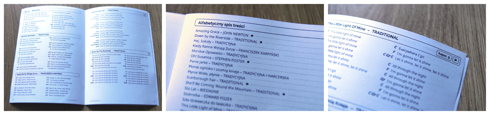

Narzędzie generujące śpiewnik gitarowy w pdf-ie z repozytorium łatwo edytowalnych plików w formacie html.



# Możliwości
* Gotowy zestaw stylów do tworzenia kolejnych stron śpiewnika
* Automatyczna numeracja stron
* Generowanie alfabetycznego spisu treści
* Tagowanie piosenek - dodawanie graficznego info o kapodasterze, piosenkach w innych językach i nowo dodanych piosenkach
* Optymalne rozkładanie piosenek na stronach, tak żeby nie zostawiać niepotrzebnego miejsca na dole stron
* Generacja plików do druku w formacie PDF zarówno w formacie standardowym oraz jako broszura (booklet)

# Instalacja
Najpierw zainstaluj najnowszą wersję [Node.js](https://nodejs.org/en/download) (projekt korzysta z natywnej obsługi TypeScripta więc jest wymagana wersja 23.6.0 bądź nowsza). Następnie otwórz konsolę i wykonaj polecenie `npm i -g songbook-generator`. Od teraz możesz używać w konsoli globalnej komendy `songbook-generator`.

# Przykładowy śpiewnik
Przykładowy śpiewnik z wymaganą strukturą plików i przykładami użycia można znaleźć w repozytorium  [sample-songbook](https://github.com/bogzio/sample-songbook).

# Komendy
Komendy należy wykonywać w głownym katalogu wybranego śpewnika. W razie problemów albo nieaktualnej dokumentacji można wywołać `songbook-generator help` albo `songbook-generator help nazwa-komendy`.

```bash
# Dodaje nową stronę z odpowiednim numerem i dwoma piosenkami,
# pierwszą w layoucie 2-kolumnowym, drugą w 1-kolumnowym:
songbook-generator add-page 2 1

# formatuje pliki html z piosenkami, porządkuje taby, porządkuje spacje między akordami itp.
# Dobrze wykonywać na bieżąco, a na pewno przed commitem.
songbook-generator format-songs

# Optymalizuje rozmieszczenie piosenek na stronach
# zawartość katalogu songs zostanie nadpisana!
songbook-generator optimize-order

# Generuje śpiewniki w formacie pdf
songbook-generator generate
```

po generacji powinny zostać wygenerowane takie pliki:
```
moj-maly-spiewniczek
└── generated
    ├── spiewnik-1.4.pdf
    └── spiewnik-booklet-1.4.pdf
```
`spiewnik` to pliki do zwykłego druku w formacie A5, `spiewnik-booklet` to pliki które po wydrukowaniu w formacie A4 (orientacja pozioma, obracanie po krótszym boku), przecinamy w połowie i składamy na pół w tej kolejności w której są. Ułatwia to druk na zwykłych kartkach A4. Do nazwy pliku jest doklejana wersja konfigurowalna w pliku `songbook-config.json` w katalogu ze śpiewnikem.

# Struktura piosenki i style

## Przykładowa struktura:
```html
<div class="page">
    <div class="song">
        <header>
            <span class="title">Wlazł Kotek</span>
            <span class="author">PANI PRZEDSZKOLANKA</span>
            <span class="tags">
                <span class="tag capo">5</span>
                <span class="tag non-polish"></span>
                <span class="tag popularity">3</span>
            </span>
        </header>
        <div class="content-wrapper columns-2">
            <dl class="content b1">
                <dt>a B</dt>		<dd class="s1">Wlazł kotek na płotek</dd>
                <dt>c D</dt>		<dd class="s2">i mruga</dd>
                <dt>e F</dt>		<dd class="b1">ładna to piosenka</dd>
                <dt>g H</dt>		<dd class="b2">Niedługa</dd>
                <br>
                ...
```
## Klasy:
* klasy do zmieniania rozmiarów, kiedy nie chcemy aby konkretne wiersze były łamane do kolejnej linijki: (`b` = bigger, `s` = smaller): `b1`, `b2`, `s1`, `s2`, `s3`, `s4` - czym wyższy numer tym bardziej tekst jest powiększony / pomniejszony.
* ustawianie na ile kolumn zostanie podzielona piosenka (domyślnie jedna): `columns-2`, `columns-3`
* tag `capo` dodaje informację o tym na jakim progu umieścić kapodaster
* tag `new` że jest to nowo dodana piosenka (na razie dodaje przy niej symbol gwiazdki a w przyszłości komenda `optimize-order` będzie miała możliwość wyboru czy przesuwać między stronami jedynie nowe piosenki)
* tag `non-polish` dodaje oznaczenie o tym, że piosenka nie jest w języku polskim (pojawi się ono tez w spisie treści, przydatne do szukania czegoś do zaśpiewania ze znajomymi nie znającymi polskiego)
* tag `popularity` pozwala ustawiać popularność piosenek, strony z wyższą sumaryczną popularnością będą umieszczane wcześniej przy optymalizacji kolejności

Po generacji plików do druku wygląd może się trochę zmienić - dodawane są np marginesy na oprawę. Natomiast jest to tak rozwiązane że miejsca na treść będzie tyle samo, więc można założyć że jeżeli nie przelewa się na pliku z pojedynczą stroną to będzie tak też w wygenerowanych plikach. Pamiętaj o wywołaniu skryptu `format-songs` przed ostatecznym sprawdzeniem - dodaje on między innymi spacje między akordami, co może wpłynąć na rozjazd tekstu.

# Licencja czcionek

Projekt zawiera czcionki:

- **Noto Sans** – objęta licencją [SIL Open Font License 1.1](https://scripts.sil.org/OFL)
- **Raleway** – objęta licencją [SIL Open Font License 1.1](https://scripts.sil.org/OFL)

Czcionki znajdują się w katalogu `styles/fonts/`, a ich oryginalne licencje zostały dołączone w podkatalogach:
- `styles/fonts/notosans/OFL.txt`
- `styles/fonts/raleway/OFL.txt`

Czcionki te **nie podlegają licencji GPL-3.0** stosowanej w pozostałej części projektu.
